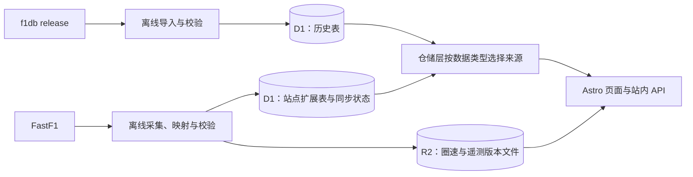

# f1db 与 FastF1 的数据分工（讨论稿）

建议保留 f1db 历史底座，用 FastF1 增加时效和分析能力。按数据类型选择来源，不用年份把整场比赛一刀切成两个数据库。本文是后续实施建议，PR #32 只交付赛程时刻补全与可选天气。

## 来源与优先级

| 数据 | 建议规则 | 原因 |
| --- | --- | --- |
| 车手、车队、赛道档案与历史统计 | f1db 为主；FastF1 标识通过映射关联 | 保持历史身份、站内 URL 和统计口径一致 |
| 已结束比赛的分类、积分、年度排名 | f1db 可用时优先；否则使用完整且验证通过的 FastF1 场次快照 | 快速结果与事后修订需要区分 |
| 未来赛程与最近赛程变更 | f1db 已有字段直接采用，FastF1 只补缺；比赛身份不一致时暂停补充 | 不建立日常两源交叉纠错机制，避免因抓取时间不同反复覆盖 |
| 2018–2023 缺失的场次时刻 | FastF1 补全 | PR #32 已实现；≤2017 保留仅日期 |
| 天气、圈速、分段、轮胎、进站过程、赛会消息 | 优先开发 FastF1 能支持的功能，缺项保持缺项 | f1db 继续提供关联档案，不覆盖分析数据 |
| 油门、刹车、速度、挡位、位置等遥测 | FastF1，按功能需要加载 | 体量大，不能塞进每次页面查询和首屏 |

例如：周六排位结束后先发布 FastF1 的整场结果并标记暂定；f1db 后续提供该场分类时切换结果来源，FastF1 的圈速、天气和遥测仍然保留。不是 f1db 一更新就删除整场 FastF1 数据。

FastF1 是 Python 取数与解析库，不是单一独立数据库。它会组合 F1 计时、赛程文件和 Jolpica，也可能自行计算结果；`source=fastf1` 不等于所有字段都来自官方最终分类。当前源码的 `Session.load()` 会尝试计算练习、排位和正赛结果，不能沿用“练习一定没有 Position”或“排位等于所有圈速直接排序”的假设。实施前固定依赖版本，用代表性样本验证。[FastF1 README](https://github.com/theOehrly/Fast-F1)、[结果加载与计算源码](https://github.com/theOehrly/Fast-F1/blob/main/fastf1/core.py)

## 数据库怎么管理

先保留一个 D1，按表的所有权隔离；真正做遥测功能时启用 R2 存储大文件。无需现在迁移 PostgreSQL 或把所有上游数据重新设计一遍。

- f1db 表是可替换的上游镜像。站点同步任务不向这些表补写，否则下次全量导入会覆盖。
- 站点表属于我们：当前是 `session_time`、`session_weather`；快速结果、车手映射、采集状态等表等相应功能落地时再建。
- D1 存页面常用的小数据：结果行、天气摘要、轮胎策略摘要、可用数据目录、R2 对象键。查询按赛季/比赛/session 建索引，沿用现有查询计划护栏。
- R2 存按 session 分组的圈速、分钟级天气和遥测文件；前端只读取已生成的 JSON，离线分析可保留压缩 Parquet。原始缓存或快照按实际排障需要保留，不要求全部上传。
- 文件写成功并校验后，才更新 D1 的版本指针；失败继续使用旧版本。D1 与 R2 没有跨服务事务，不能先让页面指向尚未存在的文件。
- 访客始终只访问本站 D1/R2/缓存，不触发 FastF1 或 f1db 上游请求。

站点表从下一次修改已有 schema 开始使用有版本号的迁移。`CREATE TABLE IF NOT EXISTS` 只解决初次建表，不能更新已有列。f1db schema 漂移与站点迁移分开验证。

## 身份、完整性与修订

比赛暂用 `(year, round)`，session 用站内标准键；同时核对赛地或 UTC 比赛日期。轮次在赛季改期时可能变化，因此未来赛程不能仅凭轮次自动覆盖；遇到改期、重排或不一致，保留旧数据并记录待处理映射。需要稳定跨变更关联时再引入站点自己的 event ID。

车手和车队建立显式来源映射。三字母码和车号可作候选匹配依据，但都不能当永久身份；同赛季青训车手可能共用正式车手的车号，临时替补也可能尚未进入 f1db。未映射的新车手应保留源身份与展示名，不应静默丢掉其结果。具体是否提供无档案链接的临时行，在快速结果功能中落实。

结果以整场 session 快照发布，避免逐车手 `COALESCE` 把两套排名拼在一起。至少验证车手唯一性、映射覆盖、名次与已知参赛名单，并抽样覆盖淘汰排位、删圈、DNS/DNF、冲刺和临时替补。空结果或部分加载成功不表示采集完成。

每批记录来源、源版本或对象哈希、解析器版本、抓取时间、结果状态。抓取时间只表示何时获取，不表示上游何时修订。f1db 提供对应场次后直接采用其结果；其缺失场次继续保留 FastF1。不要求先用 FastF1 校验 f1db，更不自动修改历史积分去“配平”。比赛身份核对是防止串场，不是事实纠错。

## 如何持续补全

历史回填与赛季增量分开调度：

1. 历史按年份分批回填 2018 起的可用数据，保存检查点。无数据就结束该项，不让每天的任务重扫整个历史。
2. 日常先读轻量赛程，判断有没有需要更新的场次；赛季比赛窗口内可每 15–30 分钟检查一次，仅采集近期已结束且待更新的 session。
3. 首次快速结果发布后安排有限次数复查，捕获迟到数据和修订；历史完整快照只在手动修复、解析器升级或明确修订时重建。
4. 同步状态区分“未尝试”“暂不可用”“成功但部分缺失”“完成”“请求失败”。无数据与网络失败不可混为一谈；失败设置退避，持续失败只保留旧快照。
5. 目标是一小时内提供赛后结果，但任务调度和上游可用性都可能延迟；首个功能测量实际延迟，不把定时触发视为准点完成的保证。

PR #32 当前代码仍是简化版本：每天重试当季空缺，已有行跳过，历史回填手动执行。这条 GitHub Actions 取数路径已实测收到官方 HTTP 403，不能作为可交付的持续同步方案。Cloudflare 迁移决定、最小验证与合并门槛见 [天气同步执行环境](decisions/weather-sync-cloudflare.md)。部分数据复查需要额外同步状态，现有 `--have` 尚不支持。

## 当前基础设施最值得补的地方

现有 f1db 导入会先 DROP 再逐表导入；期间可能出现查询失败或读到不完整数据。扩展 FastF1 之前，建议优先保证同步发布边界：

- 所有改写共享数据库的工作流使用同一写入互斥组，避免 f1db 导入、站点数据发布和 schema 迁移重叠；采集和计算可以并行。
- 从同一个明确的 release tag 下载文件、记录版本，避免多次请求 `latest` 恰逢发版而混用版本。
- 最小方案在清表前标记导入中，读取端使用已有缓存或明确的暂不可用响应，成功后再开放；若要求更新期间持续可用，再评估另一份 D1 预导入、校验后切换绑定的方案。
- FastF1 更新也必须刷新受影响页面缓存，不能只依赖 f1db release tag。先保证定向失效可靠，按访问量再细化到赛季/比赛。
- preview 当前与生产共享 D1。涉及结果来源切换和 schema 演进的后续 PR，建议先拆独立预览数据环境，避免验收数据影响生产。

这些属于后续工程，不在 PR #32 内突然改造。

## 建议实施顺序

1. 完成 PR #32：先验证 Cloudflare 采集，再实现天气同步、历史回填和缓存更新，验收后合并；不先合并失效的自动同步方案。
2. 快速赛后结果：先验证 FastF1 实际字段和延迟，再交付练习/排位；同步落地场次状态、身份映射与原子发布。正赛分类及积分接管单独验收。
3. 轮胎策略与圈速走势：优先利用每圈和 stint 数据，信息收益明显，数据量也更容易控制。
4. 车手单圈遥测比较：此时再启用 R2 版本文件、按需读取与采样降级。

天气字段实际包括气温、赛道温度、湿度、气压、降雨、风向和风速。PR #32 先展示温度中位数与是否出现降雨；不是预报，也不是精确发车时刻的读数。FastF1 低层解析可能将原始缺失字段转为 0，因此只能承诺本站不再自行补零，不能据解析结果还原上游字段是否缺失。以后需要精确缺失标记时，应保存原始字段存在性。[FastF1 天气解析源码](https://github.com/theOehrly/Fast-F1/blob/main/fastf1/_api.py)
