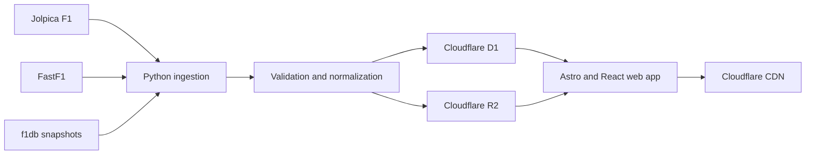

# F1 Box Product and System Design

**Date:** 2026-07-20  
**Status:** Approved baseline  
**Product:** F1 Box  
**Domain:** `f1-box.com`

## 1. Product definition

F1 Box is an unofficial Formula 1 race-weekend information hub. Its primary job is to help a fan understand the current or next race weekend quickly, then explore session results, past editions of the same Grand Prix, season archives, and—later—telemetry comparisons.

The race weekend is the main product unit. The archive and analytics features deepen that experience instead of becoming separate products.

## 2. Goals and success criteria

### Initial goals

- A visitor can understand what is happening, where, and when within 30 seconds.
- Every practice, sprint, qualifying, and race result is published within 15–30 minutes after upstream data becomes available.
- Each event links naturally to previous editions and to its season context.
- Every displayed dataset exposes its source, fetch time, and freshness state.
- The system can add richer telemetry without changing the core event and session model.

### Initial non-goals

- Second-by-second live timing.
- User accounts, comments, communities, or personalization.
- News aggregation and editorial publishing.
- Mobile applications.
- Hosting raw upstream APIs directly for third parties.

## 3. Information architecture

### Home

- Current or next race-weekend hero.
- Circuit, country, local time, visitor-local time, and session schedule.
- Championship standings entering the weekend.
- Completed session summaries and links.
- Clear navigation to the archive.

### Event page

Canonical route: `/seasons/{year}/races/{round}-{slug}`.

- Overview: circuit facts, schedule, status, and championship context.
- Sessions: practice, sprint, qualifying, and race results.
- Race detail: classification, fastest lap, pit stops, stints, retirements, and status.
- History: previous editions, winners, pole sitters, fastest laps, and result links.
- Compare: hidden in phase one and introduced with post-session telemetry in phase two.

### Archive

- Season list from 1950 to the current season where structured source data is available.
- Season page with calendar, drivers, constructors, results, and final standings.
- Circuit, driver, and constructor pages can be added without changing the primary navigation.

## 4. Delivery phases

### Phase 1 — Weekend and archive

- Current/next weekend page.
- Circuit and schedule information with timezone conversion.
- Session and race results.
- Driver and constructor standings.
- Previous editions of the same event.
- Full structured-results archive.
- Data freshness and provenance indicators.

### Phase 2 — Post-session analysis

- Driver-to-driver fastest-lap comparison.
- Track-position trace and speed, throttle, brake, gear, RPM, and DRS charts.
- Lap-time evolution, tyre stints, and degradation views.
- Shareable analysis images and links.

### Phase 3 — Live experience

- Live timing recorder operated as a dedicated process.
- Live session status and incremental updates.
- Explicit degradation behavior when upstream timing is missing or delayed.

Live timing is intentionally deferred until the archive and post-session pipeline are reliable.

## 5. Source strategy

### Jolpica F1

Primary source for structured data: calendars, circuits, drivers, constructors, qualifying, results, standings, race laps, and pit stops. The application ingests and caches responses; user requests do not proxy Jolpica directly.

### FastF1

Enrichment source for lap timing, car telemetry, position, tyres, weather, speed traps, and later live timing. FastF1 runs only in the Python ingestion environment. Its cache remains enabled because parsing is expensive and upstream requests are rate-limited.

### f1db

Used as a historical seed, offline snapshot, and cross-check source after its current license and schema are recorded. It is not a runtime dependency for page requests.

### f1-dash

Used only as product and engineering reference after its current license is verified. F1 Box will not fork or depend on it initially.

### Source precedence

1. Jolpica owns structured championship and result records.
2. FastF1 owns high-frequency timing and telemetry enrichments.
3. f1db supplies seed and validation records but does not silently overwrite primary data.
4. Conflicts are logged with source identifiers and resolved explicitly.

## 6. Architecture

F1 Box uses a serverless web tier and an offline Python ingestion tier.



### Web tier

- Astro for server-rendered and pre-rendered data pages.
- React islands for filters, comparisons, and interactive charts.
- TypeScript throughout the web application.
- Cloudflare Pages/Workers for deployment, routing, caching, and scheduled lightweight jobs.
- ECharts for initial charts; custom Canvas/WebGL is introduced only when track comparison requires it.

### Data tier

- Cloudflare D1 stores normalized, queryable entities and compact lap-level records.
- Cloudflare R2 stores immutable source snapshots, compressed JSON/Parquet, telemetry series, generated track geometry, and analysis artifacts.
- CDN-cached derived JSON prevents expensive database or object-store work on every page view.

### Ingestion tier

- Python managed with `uv`.
- FastF1 plus Polars/Pandas for extraction and transformations.
- GitHub Actions starts scheduled and manually triggered post-session ingestion.
- A persistent worker is added only for phase-three live recording.

## 7. Canonical data model

Core relational entities:

- `season`
- `event`
- `circuit`
- `session`
- `driver`
- `constructor`
- `entry`
- `session_result`
- `standing_snapshot`
- `lap`
- `pit_stop`
- `stint`
- `data_asset`
- `source_record`
- `ingestion_run`

High-frequency telemetry is not stored row-by-row in D1. A `data_asset` record points to a versioned R2 object and contains session, driver, lap, schema version, checksum, sample count, fetch time, and source metadata.

Every canonical record uses F1 Box identifiers. `source_record` maps those identifiers to Jolpica, FastF1, and f1db identifiers so upstream changes do not leak into URLs or UI contracts.

## 8. Data pipeline

1. Discover the season and event schedule.
2. Fetch an immutable raw snapshot and compute its checksum.
3. Normalize upstream identifiers into canonical entities.
4. Validate referential integrity, expected participant counts, session state, and freshness.
5. Upsert structured records into D1.
6. Write telemetry and derived assets to versioned R2 keys.
7. Publish compact page payloads and invalidate affected CDN keys.
8. Record the run, source versions, warnings, and failures.

The pipeline is idempotent: processing the same source snapshot twice produces the same canonical output. A failed enrichment does not block publication of valid structured results.

## 9. Repository structure

```text
f1-box/
├── apps/
│   └── web/                 # Astro, React, routes, and lightweight endpoints
├── services/
│   └── ingest/              # Python extraction, normalization, and analysis
├── packages/
│   ├── contracts/           # JSON Schema and public data contracts
│   ├── ui/                  # Shared design system
│   └── charts/              # F1-specific visualization components
├── db/
│   ├── migrations/
│   └── seeds/
├── tests/
│   └── fixtures/            # Pinned upstream samples
├── infra/                   # Cloudflare and CI configuration
└── docs/
    ├── product/
    ├── specs/
    ├── adr/
    └── runbooks/
```

This remains one repository and one deployable web application. No microservices are introduced in the initial phases.

## 10. Failure handling and observability

- Stale data remains visible with an explicit timestamp and warning instead of returning an empty page.
- Each page can distinguish scheduled, provisional, complete, delayed, and unavailable sessions.
- Ingestion retries use bounded exponential backoff and never overwrite the last known-good asset with an incomplete payload.
- Data-quality failures are reported separately from infrastructure failures.
- Sentry captures application errors; structured ingestion logs and a freshness dashboard cover the data pipeline.
- Alerts are generated when a completed session is still unpublished after 30 minutes.

## 11. Testing

- Contract tests pin representative Jolpica and FastF1 payloads.
- Unit tests cover identifier mapping, timezone conversion, normalization, and derived metrics.
- Data-quality tests check keys, participant references, classifications, lap ordering, and asset checksums.
- End-to-end tests cover the home page, one current event, one historical event, and a source-degradation case.
- Visual regression tests cover desktop and mobile event pages.
- Production deployment requires passing tests, a preview deployment, and independent LLM review.

## 12. Security, licensing, and brand constraints

- Secrets are stored only in GitHub and Cloudflare secret stores, never in the repository or chat.
- GitHub and Cloudflare receive least-privilege access; production deletion and credential rotation require human approval.
- Every external dataset's license and attribution requirements are recorded before publication.
- F1, Formula 1, team marks, driver imagery, broadcast footage, and official logos are treated as protected assets. The initial UI uses original graphics and a visible unofficial-site disclaimer.
- Commercial publication of live timing or derived telemetry requires a terms and licensing review before phase three.

## 13. LLM-operated delivery model

The repository is the durable operating system for the team. One coordinating LLM owns task decomposition and delegates bounded work to temporary product, data, engineering, review, and release roles.

Standard workflow:

1. Convert discussion into a written spec with acceptance criteria.
2. Obtain human approval for scope and irreversible decisions.
3. Write an implementation plan and create small issues.
4. Implement on a branch with tests and documentation.
5. Run independent code, data, and security review.
6. Publish a preview and request human acceptance.
7. Deploy, observe metrics and freshness, and propose the next iteration.

The LLM may autonomously research, edit code, run tests, create previews, and prepare releases. Human approval is required for product-direction changes, paid services, production data deletion, destructive migrations, secrets and permissions, legal/branding decisions, and public production releases.

## 14. Initial vertical slice

The first implementation proves one complete event page before loading the entire archive:

- One season schedule.
- One completed Grand Prix with all available sessions.
- Circuit overview and visitor-local schedule.
- Qualifying and race classifications.
- Championship context.
- Two previous editions of the same event.
- Provenance and freshness metadata.

After this slice passes data and UI review, the same pipeline backfills structured history and then adds post-session telemetry.
