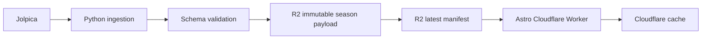

# F1 Box 第一版赛季中心设计

日期：2026-07-21  
状态：实施基线  
目标域名：`f1-box.com`

## 1. 目标

第一版交付一个可公开访问、自动更新的 2026 F1 赛季信息中心。访客可以在一个连贯体验中看到：

- 下一站比赛、当地时间和访客本地时间。
- 2026 全部比赛周末及完成状态。
- 每个已完成分站的排位赛、正赛排名与积分。
- 当前车手积分榜和车队积分榜。
- 数据来源、抓取时间和新鲜度。

第一版不包含实时计时、遥测、账户、新闻、完整历史档案和复杂搜索。

## 2. 产品结构

### 首页 `/`

- 下一站主视觉、倒计时、赛道与场次时间。
- 赛季进度轨道，可快速进入每一站。
- 最近一站领奖台和积分变化摘要。
- 车手、车队积分榜前列预览。

### 赛季页 `/seasons/2026`

- 全年赛历，区分已完成、当前、下一站和未来比赛。
- 完整车手与车队积分榜。
- 每站获胜者、杆位和主要结果摘要。

### 分站页 `/seasons/2026/races/{round}-{slug}`

- 比赛周末标题、赛道、地点、场次和状态。
- 排位赛完整分类。
- 正赛完整分类、积分、完赛状态、最快圈。
- 返回赛季上下文以及前后分站导航。

## 3. 数据架构

采用 R2-first，不在第一版引入 D1。

Python 每次运行完成以下步骤：

1. 获取 2026 赛历、每站排位和正赛结果、车手积分与车队积分。
2. 保存带校验和的原始响应，避免不可追溯覆盖。
3. 归一化为 `SeasonPayload` 并执行共享 JSON Schema 校验。
4. 上传不可变对象 `v1/seasons/2026/{checksum}.json`。
5. 最后更新 `v1/seasons/2026/latest.json`，形成原子发布。

Web 请求只读取 R2，不直接调用 Jolpica。R2 或上游失败时继续展示最后一次有效数据，并明确显示陈旧状态。

`SeasonPayload` 是面向页面的紧凑契约，包含赛季、分站、场次、分类、两类积分榜和来源。现有 `WeekendPayload` 保留为分站边界；两者共享命名与状态语义，但不建立运行时耦合。

## 4. Web 架构

- Astro 作为服务端页面与路由框架，部署到 Cloudflare Workers。
- 页面数据通过一个 `SeasonRepository` 接口读取；生产实现读取 R2，本地与测试实现读取固定 fixture。
- 第一版不引入 React。倒计时、筛选和转场使用小型原生脚本、CSS 与 Astro View Transitions，避免不必要的 hydration。
- 排名可视化使用语义化 HTML、CSS 比例条和内联 SVG，不引入图表库。
- 页面组件按职责拆分：赛季轨道、事件卡、积分榜、结果表、新鲜度、时间格式化。

这一边界允许后续把 repository 实现替换为 D1 或聚合 API，而不修改页面组件和公开契约。

## 5. 视觉系统

视觉主题命名为 Night Grid：原创的夜间赛道控制台，而不是复刻官方 F1 品牌。

- 基础色：近黑石墨、暖白和冷灰。
- 信号色：高饱和珊瑚红用于当前状态，酸性黄绿用于数据和成功状态。
- 排版：自托管开源可变字体；窄体大标题配高可读正文，数字采用等宽特征。
- 形态：倾斜切角、细网格、速度线、宽留白和清晰层级。
- 动效：首屏分层进入、赛季轨道滑动、积分条过渡、卡片焦点和页面转场。
- 无障碍：完整键盘操作、可见焦点、足够对比度，并遵守 `prefers-reduced-motion`。

不使用 F1、车队或车手官方 Logo、照片、转播素材和官方字体。车队仅使用文字、事实数据和原创色彩标记。

## 6. 自动化与发布

GitHub Actions 提供三条流程：

1. `ci.yml`：TypeScript、Python、Schema、Astro build 和 Playwright。
2. `ingest.yml`：手动触发；周五至周日每 30 分钟运行，周一至周四每日运行一次。校验成功后写入 R2。
3. `deploy.yml`：`main` 通过 CI 后部署 Cloudflare Worker。

Cloudflare 资源：

- Worker：`f1-box`。
- R2 bucket：`f1-box-data`。
- 自定义域：`f1-box.com`，`www` 重定向到根域。
- 生产凭证只保存在 GitHub 与 Cloudflare secret store。

部署顺序为本地验证、Cloudflare preview、浏览器验收、生产域名切换。生产数据删除与凭证轮换仍需人工确认。

## 7. 失败处理

- 抓取失败：重试有限次数，不更新 manifest。
- 单站数据暂缺：保留该站并标记 `unavailable`，不清空其他有效数据。
- Schema 校验失败：阻止发布并保存诊断。
- R2 manifest 缺失：返回可读的服务降级页；本地开发使用 fixture。
- 数据过期：继续显示并在全局和相关模块标注抓取时间。

## 8. 验证标准

- 首页、赛季页和任一分站页在桌面与 375px 移动端可用。
- 2026 每一站都可进入；已完成比赛展示排位、正赛排名和积分。
- 车手与车队积分榜与固定上游 fixture 一致。
- 页面不从浏览器直接请求 Jolpica。
- 数据发布采用 immutable payload + manifest-last，失败不会覆盖最后有效版本。
- `pnpm check`、`pnpm test`、Python pytest/Ruff、Astro build 和 Playwright 全部通过。
- 动效在 reduced-motion 模式下关闭或显著减弱。
- preview 验收通过后才切换 `f1-box.com`。

## 9. 后续扩展

- D1：跨赛季查询、历史档案、实体页和搜索出现后再加入。
- FastF1/R2：遥测、轮胎、圈速与赛道几何。
- Cloudflare Queues/Workflows：采集任务需要更强重试和编排时再加入。
